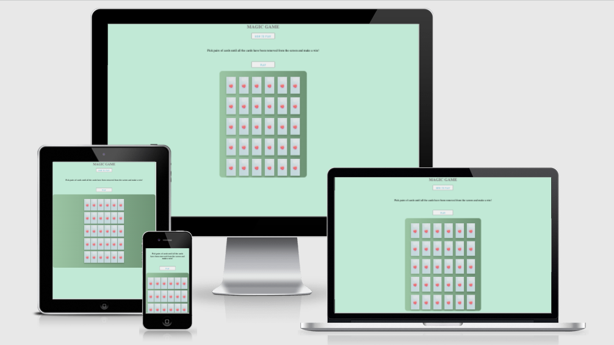
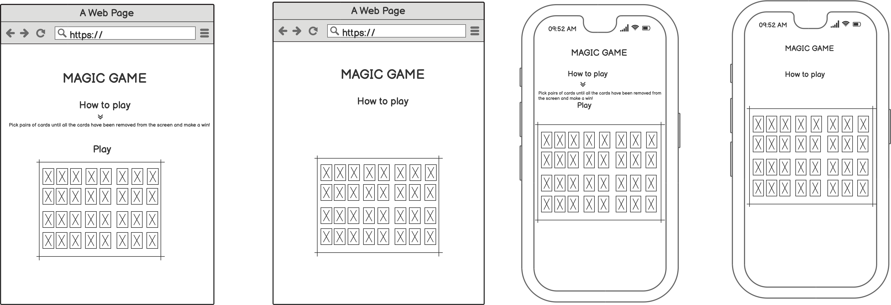
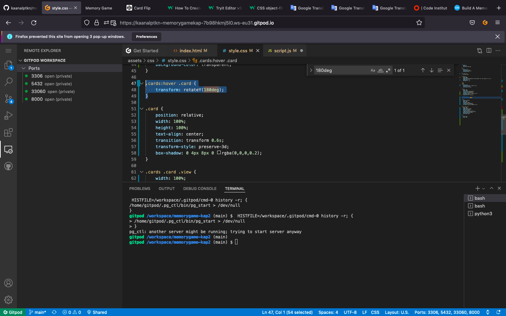
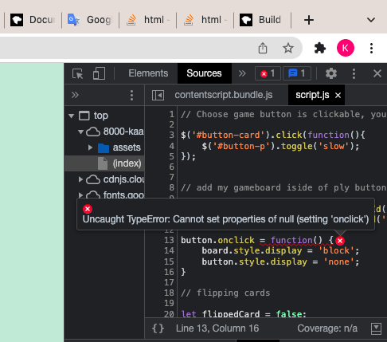
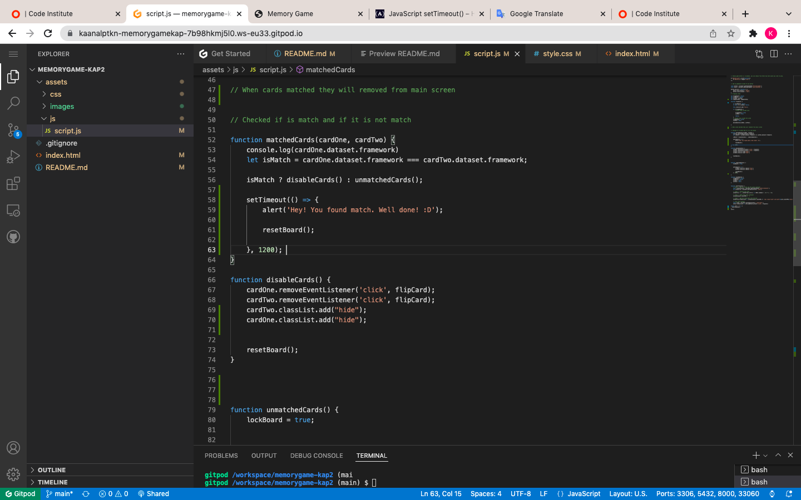
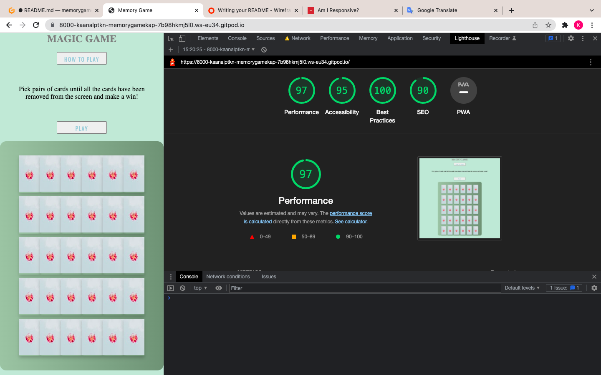
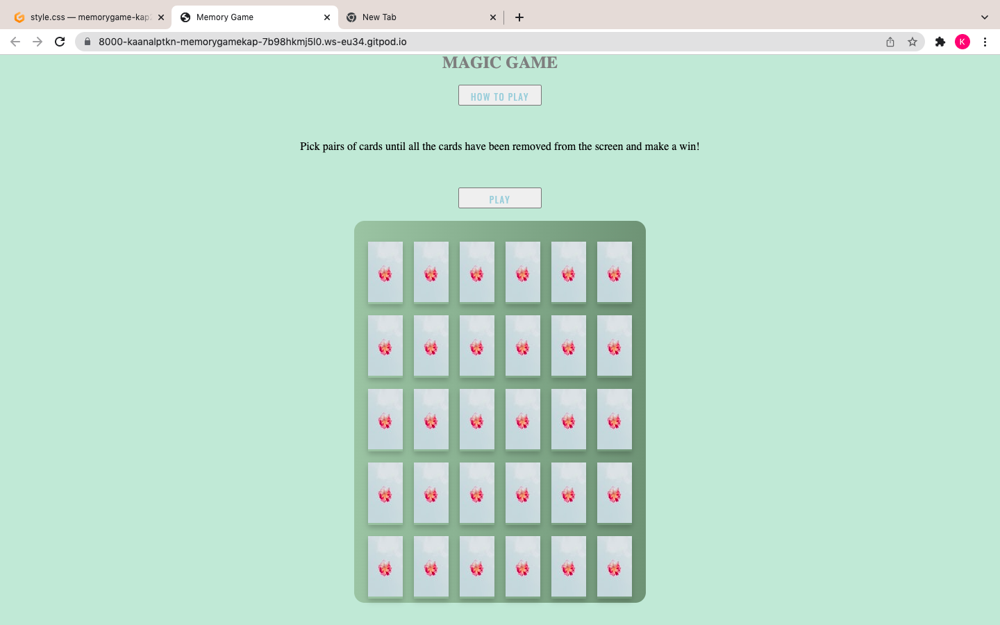
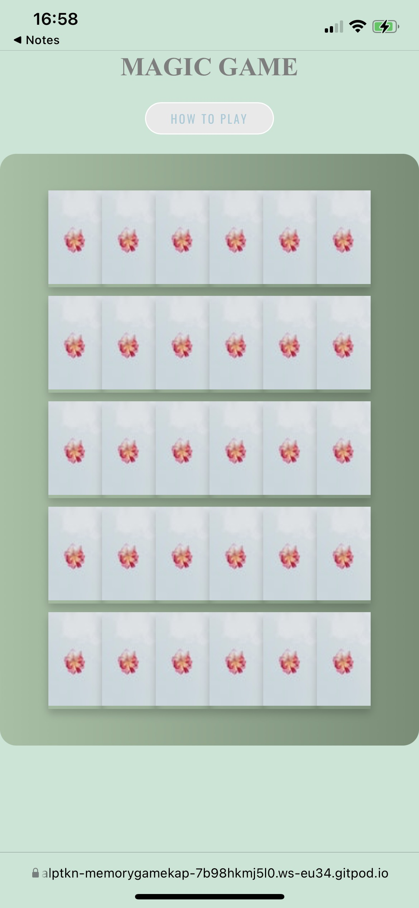

# Memory Game

## Interactive Frontend Development Milestone Project

Website presents Magic Game as a memory game. Users will be able to play interesting content in easy and simple way.

This project is for educational purposes and can not be used as a template for a business use. Main aim is to build responsive website with HTML, CSS, JavaScript. 

## [View life website in github pages] (https://kaanalptkn.github.io/memorygame-kap2/)

# Table of Contents

- [UX](#ux)
   - [Website owner business goals](#Website-owner-business-goals)
   - [User goals](#User-goals)
       - [New user goals](#New-user-goals)
       - [Returning user goals](#Returning-user-goals)
       - [Website owner business goals](#Website-owner-business-goals)
   - [User stories](#User-stories)
       - [As a business owner](#As-a-business-owner)
       - [As a new user](#As-a-new-user)
       - [As a returning customer](#As-a-returning-customer)
   - [Structure of the website](#Structure-of-the-website)
   - [Wireframes](#Wireframes)
   - [Surface](#Surface)
       - [Colors](#Colors)
       - [Fonts](#Fonts)
       - [Images](#Images)
-  [Fetures](#Fetures)
-  [Technologies](#Technologies)
-  [Testing](#Testing)
   - [Functional testing](#Functional-testing)
   - [Compatibility testing](#compatibility-testing)
   - [Code Validation](#code-validation)
   - [User stories testing](#user-stories-testing)
   - [Issues found during site development](#issues-found-during-site-development)
   - [Performance testing](#performance-testing)
-  [Deployment](#deployment)
- [Credits](#Credits)
- [Screenhots](#Screenhots)

# UX 

## Website owner business goals

The reason for creating this website is to help provide some entertiment users. Page owner can present their memory game. Also, this website is an extraordinary platform made to get away from the stress of the day and also to strengthen the memory. 

## User goals

### New user goals

* Get away from stress
* To enjoy
* Strengthen memory 

### Returning customer goals

* Get away from stress
* To enjoy
* Strengthen memory

## User stories

### As a business owner

* Keeping people away from stress. 
* To improve other brain functions, such as attention, concentration, and focus. 
* To improve visual recognition.

### As a new user 

* Basically for a first time visitor, I want to be able to easily see the purpose of the game and easily learn how to play. 

* As a first time visitor, I would like to choose the right  colour tone(I prefer light colours) that are not tire out eyes and start easy to play.

### As a returning customer

* As a returning visitor, I want to be able to just play the game without any instruction.

## Structure of the website

The Magic game  is designed to be simple and user-friendly on all types of devices. On desktop, tablet, or mobile device there should be no difference for a user to have a great experience. All parts are designed to concentrate maximum user satisfaction. Users will get some interaction from the interface as links and buttons will have a hover effect.

## Wireframes

I used this website Balsamiq to create  wireframes.

# Surface

### Colors

Main colours used in a project:
* background color: rgba(197, 228, 211, 0.952)
* font color: rgb(161, 203, 216);
* other colors: rgb(163, 192, 163), rgb(117, 143, 117), black, whitesmoke

### Fonts
* I generally used Oswald for the body. The reason why I chose these fonts is that my page is more tidy and does not tire the eyes while looking at my page. 

### Images
* I used images from [Pixel.com](https://www.pexels.com/)) and there are credited in [credits](#credits) section.

[Back to Table of contents](#table-of-contents)

___

# Fetures

The website consists of one page.

The website has below features:

## Buttons

* #### There is two buttons visible on the top of the website. It is responsive and will adapt to mobile devices as well. 

* Navigation scheme:

 * On first top there is a "How to play button". i is explaining game's rule.

 * And the bottom of the "How to play button" you can see "Play" button. Users could clike there and start game.
   
## Gameboard

* Users can find gameboard bottom of the Play button.  Theres is 32 images for gamers, they need to pick all pairs for to finish game. 

[Back to Table of contents](#table-of-contents)

___

# Technologies

### HTML

* As a structure language.

### CSS

* As a style language.

### JavaScript

* As a script language

### Font Awesome

* I used Font Awesome add icons for aesthetic and UX purposes.

### Google fonts

* Google fonts were as a font generator to import the  "Oswald" font into the style.css file which is used on all pages throughout the project.

### GitHub

* Github used as a software hosting platform and  for keeping the project remote location.

### Git

* Git was used as an information tracker on the version control  by utilizing the Gitpod terminal to commit to Git and Push to GitHub.

### Gitpod

* As a development hosting platform.

### Balsamiq

* Balsamiq was used to creat the [wireframes](#wireframes) tool during the design process.

[Back to Table of contents](#table-of-contents)

# Testing 

## Functional testing

I used the Google Chrome developer tools and Mozilla web developer tools to test and fix issues with responsiveness and styling issues. In the style.css file, both tools made it extremely easy for me to use margin, padding, font, width, height and other elements correctly use on my web page.

[Unicorn Revealer](https://chrome.google.com/webstore/detail/unicorn-revealer/lmlkphhdlngaicolpmaakfmhplagoaln?hl=en-GB) was very handy and it helped me a lot when I built my website. 

## Compatibility testing

My website has been tested with multiple mobile devices and browsers. I've tested extention  devices in both Mozilla web developer tolls and Chrome developer tools. 
 
Also, I tested on hardware devices such as iPhone 6, iPhone 7plus, iPhone 11, iPhone 12, and Samsung Galaxy S10,  Galaxy S21.  

## User stories testing

### As a new user 

* Basically for a first time visitor, I want to be able to easily see the purpose of the game and easily learn how to play. 

* As a first time visitor, I would like to choose the right  colour tone(I prefer light colours) that are not tire out eyes and start easy to play.

### As a returning customer

* As a returning visitor, I want to be able to just play the game without any instruction.

## Issues found during site development

#### rotate element on desktop view

 

  The photos were not flipping because I couldn't put the flipping element correctly. First I added transform:rotateY(180deg);  to ".face" and ".back" elements in style.css.  I also wrote the code in the screenshot below in script.js. Then with the tutor supports I found out that I need to add the ".card" and ".flip" elements to transform: rotateY(180deg); . 

#### Uncaght type error on desktop view.

I  was tryin to add my gameboard inside the play button, it means when you "play" button game to strat, Then i saw below issue as an screenshot. I thought my code is wrong and added if else element to the onclick button, but it didn't work. Then I connected wit my tutor and we found that I had a three misakes there; I had an incorrect spelling in one of your selectors. I had not set the #cards-container to display: none in your css I was missing a closing } on the onclick function.

The issue was, on my gameborad when my crads matched was being removed from board before see second card face.  Although I searched for a long time on the internet what I should do to fix this, I could not find it. Then I got tutor support, and I added setTimeout element to disabledCards and added "hide" element to inside it, this way the problem was solved.

## Performance testing

I used [Lighthouse](https://developers.google.com/web/tools/lighthouse/) for performance testing. I found it very handy and useful. I didn't find any necessary issue/

### Final result:

## Code validation

* [W3C HTML validator](https://validator.w3.org/)
* [W3C CSS validator](https://jigsaw.w3.org/css-validator/)
* [JavaScript validator ](https://jshint.com/)

[Back to Table of contents](#table-of-contents)

___

# Deployment

My project was deployed on GitHub Pages. I used Gitpod as a development occasion,  I commit all changes to git version control system. 
I used push command in Gitpod to save all my changes into GitHub.

To deploy a project I used the following instructions:

1. Log in to GitHub and open the repository to deploy ([Memeory Game](https://kaanalptkn.github.io/memorygame-kap2/))
2. Select `Settings`(on the right side, not top of the page) and then from right side of the menu find  "Pages" section at the very bottom of the page
3.  Select the `main` branch as the source.
4.  click `save` and page was deployed after auto-refresh.
>  Your site is published at https://kaanalptkn.github.io/memorygame-kap2/

To run localy:
1. Log in to GitHub and click on repository to download [Memeory Game](https://kaanalptkn.github.io/memorygame-kap2/))
2. Select `Code` and click Download the ZIP file.
3. When download you can extract the file and use it in your local environment 

Alternatively, you can [Clone](https://docs.github.com/en/free-pro-team@latest/github/creating-cloning-and-archiving-repositories/cloning-a-repository)
or [Fork](https://docs.github.com/en/free-pro-team@latest/github/getting-started-with-github/fork-a-repo)
this repository ([KA-P1](https://kaanalptkn.github.io/ka-p1/)) into your github account.

[Back to Table of contents](#table-of-contents)

___

# Credits

### Content

* This game created by myself, all main idea is mine. 

### Media

#### Image

##### [Pixel.com](https://www.pexels.com/)

* [Photo by Sharon McCutcheon from Pexels](https://www.pexels.com/photo/rainbow-buttercream-frosting-3713892/?utm_content=attributionCopyText&utm_medium=referral&utm_source=pexels)

* [Photo by Luis del Río from Pexels](https://www.pexels.com/photo/person-walking-between-green-forest-trees-15286/?utm_content=attributionCopyText&utm_medium=referral&utm_source=pexels)

* [Photo by Greta Hoffman from Pexels](https://www.pexels.com/photo/stylish-black-crossdresser-on-floor-7675770/?utm_content=attributionCopyText&utm_medium=referral&utm_source=pexels)

* [Photo by Helena Lopes from Pexels](https://www.pexels.com/photo/white-horse-on-green-grass-1996333/?utm_content=attributionCopyText&utm_medium=referral&utm_source=pexels)

* [Photo by Willian Luiz from Pexel](https://www.pexels.com/photo/adorable-funny-dog-lying-on-grass-with-tongue-out-7444093/)

* [Photo by Shiva Smyth from Pexels](https://www.pexels.com/photo/closeup-photography-of-stacked-stones-1051449/?utm_content=attributionCopyText&utm_medium=referral&utm_source=pexels)

* [Photo by lilartsy from Pexels](https://www.pexels.com/photo/snowy-majestic-mountain-near-clear-cold-lake-4855615/?utm_content=attributionCopyText&utm_medium=referral&utm_source=pexels)

* [Photo by willsantt from Pexels](https://www.pexels.com/photo/child-holding-clear-glass-jar-with-yellow-light-2026960/?utm_content=attributionCopyText&utm_medium=referral&utm_source=pexels)

* [Photo by thanhhoa tran from Pexels](https://www.pexels.com/photo/view-of-rice-terraces-1447092/?utm_content=attributionCopyText&utm_medium=referral&utm_source=pexels)

* [Photo by Marek Piwnicki from Pexels](https://www.pexels.com/photo/red-and-white-flower-petals-10747743/?utm_content=attributionCopyText&utm_medium=referral&utm_source=pexels)

* [Photo by Amir SeilSepour from Pexels](https://www.pexels.com/photo/close-up-photo-of-a-woman-wearing-makeup-5693815/?utm_content=attributionCopyText&utm_medium=referral&utm_source=pexels)

* [Photo by ZHANNA TIKHONOVA Tt from Pexels](https://www.pexels.com/photo/grayscale-photo-of-woman-holding-her-face-8857342/?utm_content=attributionCopyText&utm_medium=referral&utm_source=pexels)

* [Photo by Denise Duplinski from Pexels](https://www.pexels.com/photo/classic-stone-sculpture-of-resting-male-3814319/?utm_content=attributionCopyText&utm_medium=referral&utm_source=pexels)

* [Photo by Mikhail Nilov from Pexels](https://www.pexels.com/photo/teal-textile-on-flat-surface-7676887/?utm_content=attributionCopyText&utm_medium=referral&utm_source=pexels)

[Back to Table of contents](#table-of-contents)

___

# Screenhots

## Project screenshots on desktop view and some mobile view:

[Back to Table of contents](#table-of-contents)

___